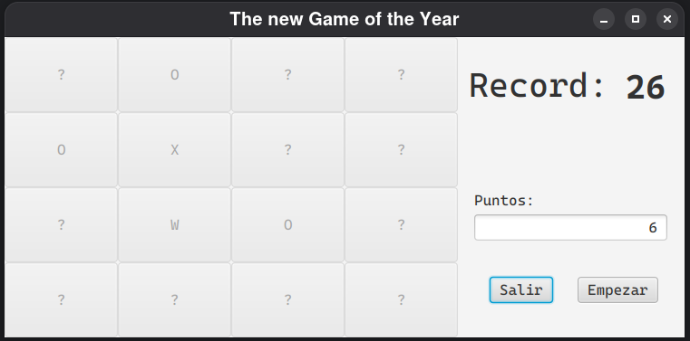

# The New Game of the Year (JavaFX)

## Índice
1. [Descripción](#descripción)  
2. [Tecnologías](#tecnologías)  
3. [Requisitos](#requisitos)  
4. [Uso](#uso)  

---

## Descripción
Proyecto de clase del módulo de Desarrollo de Aplicaciones Multiplataforma (DAM). Juego en JavaFX en el que al pulsar **Empezar** aparece un tablero de 4×4 con casillas ocultas. Cada casilla revela un símbolo al hacer clic:  
- **O** suma 1 punto  
- **W** duplica tus puntos  
- **X** termina la partida  

El reto es acumular la mejor puntuación posible antes de descubrir una **X**. Con este proyecto practiqué JavaFX (FXML, CSS y controladores) y manejo de eventos en Java.

---

## Tecnologías
- Java 8+  
- JavaFX (FXML, controles, eventos)  
- CSS para estilos (`application.css`)  

---

## Requisitos
- JDK 8 o superior con JavaFX  
- IDE con soporte JavaFX o configuración de JavaFX en línea de comandos  

---

## Uso
    git clone https://github.com/eaomarb/GameOfTheYear.git
    cd GameOfTheYear

Desde un IDE:  
    1. Importa el proyecto como JavaFX
    2. Ejecuta la clase `application.Main`  

Desde la terminal:  

    javac application/*.java  
    java application.Main  
